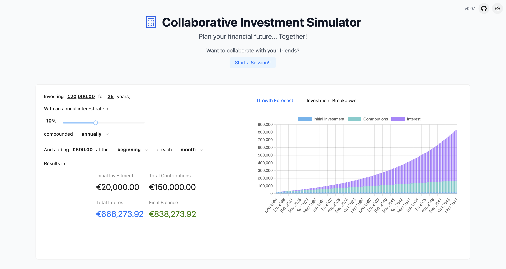

# Investment Calculator

A collaborative web application that allows users to calculate and visualize investment scenarios in real-time with others, similar to how Google Docs or Figma enable simultaneous collaboration.

👉 [calculator.afonsocrg.com](https://calculator.afonsocrg.com):

[](https://calculator.afonsocrg.com)


## Running locally

```bash
# Clone the repo
git clone git@github.com:afonsocrg/collaborative-calculator.git
cd collaborative-calculator

# Install dependencies
npm i

# Run the development server
npm run dev
```

## Contributing

If there's an issue or feature or bug fix you'd like to see, please open an issue or submit a pull request.
All contributions are very welcome!

## License

This project is licensed under the Apache License 2.0 - see the [LICENSE](LICENSE) file for details.
